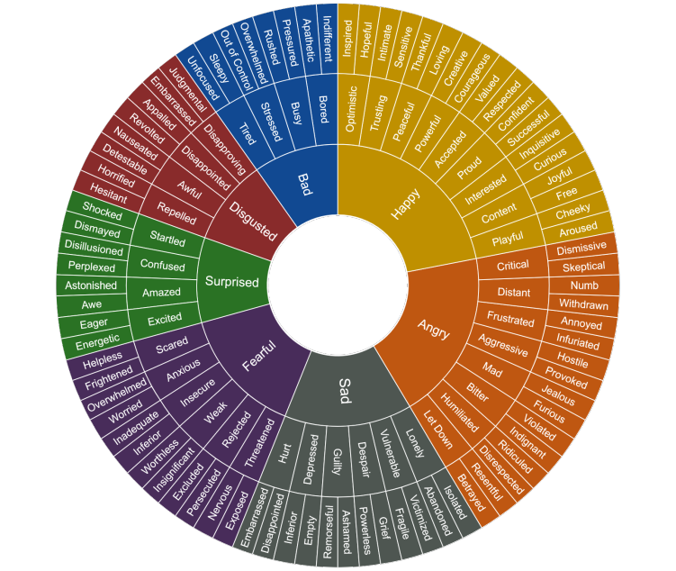

## Why Dealing with Emotions is a Problem
Often people understand very logically that they want to make a change or to act in a certain way. However, they are unable to act because they do not acknowledge the emotional component involved with every decision. No matter how much information they gain about the best way to change, the emotional component can easily block us from acting.

:::info
Most people have trouble dealing with their emotions because they either suppress their emotions or are alexithymic, which is the inability to determine your internal emotional state.

> For example, people who say that they are "in control" of their emotions often say "I can watch/experience... and I will not feel...". This is not control. This is suppression. When people suppress one emotion, they suppress all emotions.
:::

---

## Emotional Suppression
Here's why we suppress our emotions:

### Adaptive/Protective Mechanism
When we experience negative emotions at an early age and have no one to guide us through these emotions, we learn to suppress them to keep ourselves safe.

> For example, those that are bullied, have abusive/neglectful parents, or deal with high expectations often learn to suppress their emotions because nobody teaches them how to handle these emotions safely.

### Cultural Influence
Men are taught not to express emotions such as fear, sadness, and shame. They are taught to show only one negative emotion, which is anger.

> For example, we see this in the way that men express their emotions in physical language (psychosomatic) like "kick in the nuts," or "butterflies in my stomach."

---

## Unsuppressing Emotions
### Recognizing Emotions
1. Recognize that you are feeling emotions. Notice physical sensations, such as a pit in the stomach or tightness in the chest, because they are physical indicators to an emotional equivalent existing. Also notice when you use umbrella terms such as "stressed", "frustrated", "overwhelmed", "anxious", and "sucks."
2. Try to diagnose that emotion. Ask yourself if you feel:
shame (embarrassed)
   - fear (worry)
   - anger (frustration)
   - sadness
   - hopelessness
   - powerlessness
   - regret
   - grief
   - or even a mixture of those emotions.  
   If you have trouble, ask yourself "what would someone in my situation feel?" Despite being emotionally unempathetic, most of us are quite cognitively empathetic, which means that we can analytically predict how someone else feels.
3. Process it

When you experience these emotions, try to find them on this wheel of emotions.  

### Processing Emotions
1. Awareness precedes control; diagnosis precedes treatment. "It is easy to control a wild water hose when you know where the knob is." Just acknowledging that you are experiencing a negative emotion is a large step in processing negative emotions.  
> For example, you can't control your tongue when your mouth is numb from going to the dentist.

2. Work on the body. Physical feelings are psychosomatic with emotions, and emotions are psychosomatic with physical feelings. Doing things such as yoga can help process your emotions. It also improves anxiety and depression because it is mind-body exercise. Working out is good but does not engage the mind as well as yoga. Meditation are also a good way of processing emotions.
3. Work on the mind. This means having conversations with friends, talking to a therapist, talking with mental health coaches, joining a men's/women's support group, attending refuge recovery like AA, or CGAA, meditating, and journaling.

---

## Emotional Instability
That is called emotional lability and it is tied to gaming. Video games suppress our emotional circuitry and those emotions remain floating right beneath the surface. The nature of having them float so close to the surface is that they can explode very easily and then calm down easily as well. That is what happens when people do not process their emotions and suppress them via gaming.

A lot of these mood swings come from suppressing emotions and then having them resurface when the pressure builds up again and again. The solution is to process and let out the emotion, which can be done through therapy, meditation, etc.

---

## Emotional Suppression
The brain's amygdala and hippocampus turn on when people experience pain. When people play games these parts of the brain shut off. As a result, video games reward people by suppressing negative emotions.

The more you play games, the better you get at suppressing your emotions (men are especially susceptible to this). It is similar to forgetting a language that you haven't spoken in a couple of months.

> For example, if you get into a fight with your parents and then you turn on a video game. All those emotions get shut off. A lot of the time, people feel that everything is fine. They think they are happy, healthy, and enjoy gaming but actually, they have a lot of subsurface emotions that they are not even aware of.

Eventually, those emotions start to bubble to the surface and impact their lives and an emotional geyser starts to build up inside. Eventually, the pressure becomes too strong and it explodes. That is when these emotions can be terribly overwhelming.

For some, it might be when they are about to go to bed at night, after a long session of gaming. The gaming would suppress their emotions, but after turning it off, all those bottled up emotions would start to flood back. 