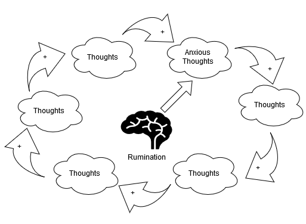

## What is Anxiety?
Anxiety is our ability to predict danger and warn us about it. It gives us the opportunity to look into the future, anticipate problems, and take corrective action now in order to prevent bad outcomes.

> For example, consider being worried about looking stupid at a party, or being afraid of failing a test, or being rejected in a job interview. All of these things are examples of our mind looking into the future, analyzing the situation, and warning us about danger so we can do something about it.

Sometimes people say that they have anxiety over the past. But if we tunnel down into that even then, anxiety is the anticipation of future consequences of a past action.

> For example, one might say “I’m anxious about what I said at the party last night.” While that looks like a past-facing statement, it’s actually the underlying worry of what people WILL think about what this person said at the part earlier. Its the anticipation of what will happen as a result that causes anxiety.

:::info 
Moreover, the smarter you are, the worse your anxiety will be. The more that your mind can compute potential futures, the more potential problems your mind will tell you to worry about.
:::

---

## Characteristics of Anxiety
1. Anxiety is worse for intelligent people. That is because a higher intelligence correlates with a better ability to predict problems in the future.
2. Anxiety is not an illness that infects us. For most people, it is a maladaptation of a normal function of their mind.
3. Anxiety is learned, and depending on one's past experiences, it can manifest in different ways. Therefore, it is often a learned protective mechanism that developed during exposure to threatening situations.

Anxiety can cause a lot of suffering. However, since it is a part of our mind, we can tame it. We can learn to control it and activate it when we need it, instead of allowing it to control us.

---

## Manifestation of Anxiety
Anxiety usually manifests in the form of future-facing thoughts. These thoughts typically have two components:
1. A future facing component: "what if..." and "will..."
2. A self or ego-facing component: "I" and "me."

Therefore, an anxious thought is usually something like:  
"Future Facing Thought + Ego/Self + Context of anxiety"

> For example:  
> "**What if I** can't get a girlfriend/boyfriend?"  
> "**Will I** be good enough to pass the test?"

Anxiety can also manifest as physical sensations such as tightness in your chest, nausea, butterflies in your stomach, headache, sweaty palms, and/or shortness of breath.

---

## How Anxiety Harms Us
Uncertainty is really frightening, and so we try to remove the uncertainty. We try to alleviate our anxiety by trying to control something in the future.

> For example, if you crack a joke at someone’s expense, you might worry about offending them. Your mind will tell you to apologize just in case, even though they haven’t given you any reason to believe that they were offended. You might try to remove the uncertainty of that person being offended by trying to apologize just in case.

The other way we try to remove uncertainty is by not triggering it at all. If we avoid certain situations entirely, then we can control for any potential negative outcomes that could happen.

> For example, if you don’t even show up at a party, then there is no chance for you to misspeak or say something stupid. You control the worry completely by avoiding the situation entirely. People might study really hard for a test if they are worried about failing it.

The problem is that oftentimes, our solutions for anxiety, and our desire to exert control is very restrictive and causes us to suffer. If you don’t go to the party, no one can think that you’re dumb because you’re not there, but then you end up never going to parties. You end up narrowing the scope of your life and restricting the things that you can do.

The trouble is that a lot of the time, anxiety has positive benefits. It can get you to study really hard for a test, even if you end up skipping all social events and staying up really late at night.

The other problem is that if we give in to our anxiety, we can become so concerned that we overcompensate and make the problem worse.

> For example, if we’re worried that people don’t like us, and we apologize more profusely, which can be off-putting and annoying to other people, which makes people not like us. It becomes a self-fulfilling prophecy. It’s our solution to our anxiety that creates more problems.

The other problem with anxiety is that if we give in to our anxiety too much, then we become easy for people to take advantage of.

> For example, if you are too anxious, you might end up behaving a doormat: you might apologize too much and never stand up for yourself. Sometimes you will run across people who will never want to admit that they did anything wrong, and they will take advantage of you. It becomes a very convenient pairing for them.

Anxiety is also often rooted in some kind of insecurity.

For example, consider hanging out with your dog. Are your anxious? Why not? Its because you have confidence that your dog likes you as a person. Also consider why you do or do not feel anxious playing a competitive video game. You might be confident about your ability to engage in the game, even though you might win or lose. You have faith in yourself to face that uncertainty.

---

## Effects of Anxiety

:::info Anxious thoughts breed more anxious thoughts. This vicious cycle of growing anxiety is called rumination.

Moreover, anxiety is circular. This increase in thoughts fuels more thoughts, and over time this leaves the mind exhausted.
:::

In contrast, a non-anxious thought process goes something like this:

1. We have a problem, which leads to thinking.
2. Thinking leads to a solution.
3. The solution solves the problem, which leads to fewer thoughts.

Therefore, problem-solving is linear and results in fewer thoughts, which is relaxing compared to anxiety.

---

## Coping with Anxiety
Since anxiety is the mind’s ability to think in the future, if we bring the mind into the present, it becomes impossible for anxiety to exist.

**Good ways to cope**
1. Do a focusing meditation.
2. Take a bath. Be fully immersed in the experience.
3. Watch a sunset.

**Bad ways to Cope**
1. Video games.
2. Watching TV shows/movies.
3. Substance use.

### Confidence and Insecurity
The other interesting solution is that once you actually end up in situations where you have to engage, such as a party, if you can actually focus on the experience of engaging with people, the anxiety melts away. It’s the anticipation of engaging that keeps you stuck.

Therefore, the other solution to anxiety is to develop confidence. Consider how you try to remove the uncertainty to control your anxiety. However, that makes the problem worse because you never face uncertainty and therefore, never develop the confidence to face it. That means that every time life throws uncertainty at you, your anxiety gets worse.

So, if you can develop confidence to face uncertainty. Resolve your personal insecurity, so you don’t need to control your environment to alleviate anxiety. If you don’t need to control your life, your life becomes less restrictive, and you become more free.

### Taming Anxious Thoughts
AN important thing to keep in mind is to not argue with your anxious thoughts. If you argue with these thoughts, they will grow and create tension in your mind. Therefore, simply observing and letting the anxious thoughts pass and without trying to fight them is a great way to turn off the mind and prevent the anxious thoughts from multiplying.

> **Solution:**
> 1. Future - bring the mind to the present through meditation or other meditative practices.
> 2. Growing tension - don't feed the mind; don't argue and reassure the anxious thoughts
> 3. I/Me - decrease the ego 